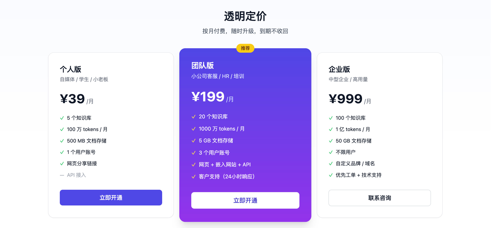
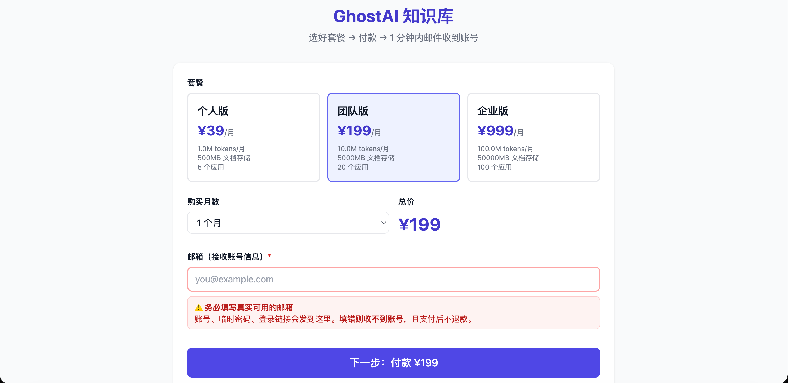

# 🤖 GhostAI 知识库

**5 分钟拥有专属的 AI 知识库 · 国内合规部署 · 中文优化**

把你的文档变成能对话的 AI 助手 · 客服 / 内部 Wiki / 培训问答 / 合同审查，一个平台全搞定

[👉 立即开通](https://www.ghostai.top/buy) · [📖 使用教程](https://www.ghostai.top/docs) · [💬 联系咨询](#联系咨询)

  

---

## 🎯 GhostAI 是什么

GhostAI 是一个**开箱即用的 AI 知识库 SaaS**，基于 [Dify](https://dify.ai) 内核 + 国内主流模型，专为中文场景和国内合规需求优化：

- 📚 **秒级文档问答**：上传 PDF / Word / Markdown / 网页一键搞定，自动切块、向量化、附引用来源
- 🇨🇳 **中文优化**：DeepSeek V4 中文理解领先，bge-m3 1024 维嵌入对中文检索做深度优化
- 🔒 **数据隔离 + 国内部署**：每个客户独立工作区，文档不出境，符合 GDPR / 国密合规要求
- 🔌 **3 种接入方式**：网页分享链接、嵌入企业官网、REST API 全支持
- ⚡ **5 分钟上手**：无需服务器、无需部署，可视化创建应用 + 自然语言写工作流

## 🆚 为什么是 GhostAI（而不是其他选择）

| | GhostAI | Dify 自建 | Dify 官方 Cloud | ChatGPT 企业版 |
|---|---|---|---|---|
| 开通 | 5 分钟 | 1-3 天部署 | 5 分钟 | 注册门槛高 |
| 数据合规 | ✅ 国内 | ✅ 自托管 | ❌ 海外服务器 | ❌ 海外 |
| 中文模型 | ✅ DeepSeek V4 | 需自配 | OpenAI/Anthropic | OpenAI |
| 运维 | ✅ 我们管 | ❌ 你管 | ✅ Dify 管 | ✅ OpenAI 管 |
| 月费起步 | ¥39 | 服务器 ¥100+ | $59 / ≈¥430 | $25/人/月 |
| 用量按需 | ✅ 套餐预付 | 自付 token | ✅ 但出海币付 | $$$ |

## 📦 套餐定价

  

| | 个人版 | 团队版 ⭐ | 企业版 |
|---|---|---|---|
| **月费** | ¥39 | ¥199 | ¥999 |
| 知识库数量 | 5 个 | 20 个 | 100 个 |
| Tokens / 月 | 100 万 | 1000 万 | 1 亿 |
| 文档存储 | 500 MB | 5 GB | 50 GB |
| 账号数 | 1 | 3 | 不限 |
| 网页分享 | ✅ | ✅ | ✅ |
| 嵌入网站 | ❌ | ✅ | ✅ |
| API 接入 | ❌ | ✅ | ✅ |
| 客户支持 | 邮件 | 24h 响应 | 优先工单 |
| 自定义品牌 | ❌ | ❌ | ✅ |

> 所有套餐均含 **7 天试用**，不满意全额退款 · 需要私有化部署？[联系商务](#联系咨询)

## 🚀 怎么用

### 1. 自助下单（5 分钟）

  

1. 访问 [www.ghostai.top/buy](https://www.ghostai.top/buy) 选套餐
2. 输入邮箱 → 点"立即付款"
3. 扫码支付（支付宝/微信均可）→ 上传付款截图
4. 1 小时内收到欢迎邮件 + 临时密码 + 登录链接

### 2. 上传文档 + 提问

  

- 拖入 PDF / Word / Markdown / 粘贴网页链接
- 系统自动切块 + 向量化（bge-m3 中文优化）
- 创建对话应用 / 工作流 / Agent
- 内嵌到你的官网，或者用 REST API 接入业务系统

### 3. 多种使用场景

- 🛍️ **电商客服**：产品手册 → 智能答疑机器人，嵌入企业微信/小程序
- 🏢 **内部 Wiki**：员工手册 + SOP + FAQ → 全员自助查询
- 🎓 **培训问答**：课程资料 → 学员 24h AI 助教
- 📋 **合同审查**：法务文档 → 关键条款一键查询
- 💼 **HR 招聘**：JD + 简历库 → 智能匹配 + 候选人筛选

## 🛠️ 技术栈（透明公开）

GhostAI 不黑盒，技术栈对你公开：

- **大模型**：DeepSeek V4（中文）+ 可选 OpenAI / Claude / Qwen / GLM
- **嵌入模型**：bge-m3（1024 维，对中文优化）
- **向量库**：Qdrant（开源高性能向量检索）
- **应用框架**：[Dify](https://dify.ai)（开源 LLMOps 平台）+ 内部定制白标
- **基础设施**：国内合规服务器 + 阿里云 BGP + DigiCert TLS 1.3
- **数据备份**：每日自动备份到本地 NAS，30 天滚动保留

## 📞 联系咨询

需要企业版定制 / 私有化部署 / 培训对接：

- 微信：扫码加客服（首页 /buy 底部）
- 邮箱：support@ghostai.top
- 官网：[www.ghostai.top](https://www.ghostai.top)

## 🤝 联盟分销

成为 GhostAI 推荐人，**首单返 30%**（personal ¥11.7 / team ¥59.7 / enterprise ¥299.7）：

- 在 admin 后台注册推荐人 → 拿到专属 code（如 `P198S9N`）
- 推广链接 `https://www.ghostai.top/buy?r=<CODE>` 分享
- 公开成单 dashboard `https://www.ghostai.top/r/<CODE>` 实时看业绩
- 每周一手动转账到登记的支付宝/微信

详见 [docs/AFFILIATE.md](docs/AFFILIATE.md)

## 📚 文档

- [快速开始](docs/QUICKSTART.md)
- [使用场景](docs/USE_CASES.md)
- [常见问题](docs/FAQ.md)
- [API 文档](docs/API.md)
- [联盟分销](docs/AFFILIATE.md)
- [更新日志](docs/CHANGELOG.md)

---

如果觉得 GhostAI 有用，欢迎 **Star** ⭐ 支持一下，或者把它分享给可能用得上的朋友。

🌐 [www.ghostai.top](https://www.ghostai.top) · 国内 AI 知识库 SaaS

